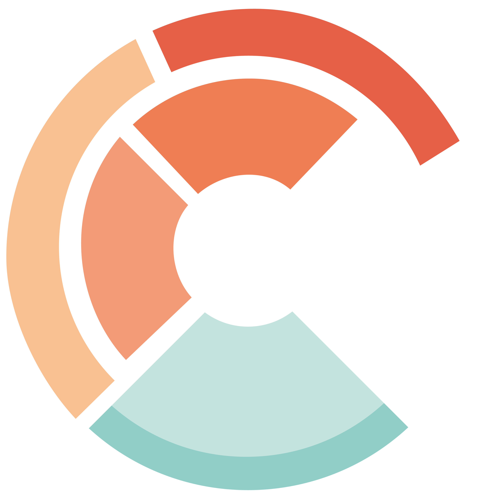

## Precursors {.smaller .nostretch}

:::: {.columns}
::: {.column width="50%"}
#### Slides and Materials

The material for this workshop, including a link to the slides to follow on your own
device, can be found at:
[github.com/Cambridge-ICCS/FTorch-workshop]( https://github.com/Cambridge-ICCS/FTorch-workshop)

::: {style="text-align: center"}

:::

:::
::: {.column width="50%"}
#### Licensing

Except where otherwise noted, these presentation materials are licensed under the Creative Commons
[Attribution-NonCommercial 4.0 International](https://creativecommons.org/licenses/by-nc/4.0/legalcode) ([CC BY-NC 4.0](https://creativecommons.org/licenses/by-nc/4.0/)) License.

{width=40% fig-align="center"}

Vectors and icons by [SVG Repo](https://www.svgrepo.com)
under [CC0(1.0)](https://creativecommons.org/publicdomain/zero/1.0/deed.en) or
[FontAwesome](https://fontawesome.com/) under [SIL OFL 1.1](http://scripts.sil.org/OFL)
:::
::::

<!-- =============================================================================== -->



<!-- =============================================================================== -->



<!-- =============================================================================== -->



<!-- =============================================================================== -->

## Further Information {.smaller}

For more details on the development see slides and recording from a recent talk here:
[jackatkinson.net/slides/Oxford-FTorch/](https://jackatkinson.net/slides/Leeds-N8-FTorch)

:::: {.columns}
::: {.column width="50%"}

:::
::: {.column width="50%"}

:::
::::

Or, for the lastest on what's new in FTorch, see
[jackatkinson.net/slides/CESM-Jun-26](https://jackatkinson.net/slides/CESM-Jun-26)



<!-- =============================================================================== -->



<!-- =============================================================================== -->



<!-- =============================================================================== -->



<!-- =============================================================================== -->



<!-- =============================================================================== -->



<!-- =============================================================================== -->



<!-- =============================================================================== -->

<!--  -->

<!-- =============================================================================== -->

## Thanks for Listening {.smaller}

For more information please speak to us afterwards, or drop us a message.

:::: {.columns}
::: {.column width="45%"}
 \ Jack Atkinson

 \ [jwa34[AT]cam.ac.uk](mailto:jwa34@cam.ac.uk)

 \ [jatkinson1000](https://github.com/jatkinson1000)
:::
::: {.column width="10%"}
:::
::: {.column width="45%"}
 \ Joe Wallwork

 \ [joe.wallwork[AT]damtp.cam.ac.uk](mailto:joe.wallwork@damtp.cam.ac.uk)

 \ [jwallwork23](https://github.com/jwallwork23)
:::
::::

\

\

Thanks to the rest of the FTorch team and contributors.

The ICCS received support from {height=2em style="margin: 0; vertical-align: -2%"}

FTorch has been supported by {height=1.4em style="margin: 0; vertical-align: -2%"}

{style="width: 18%;" .absolute bottom=24% right=11%}

{style="width: 30%;" .absolute bottom=12% right=5%}
